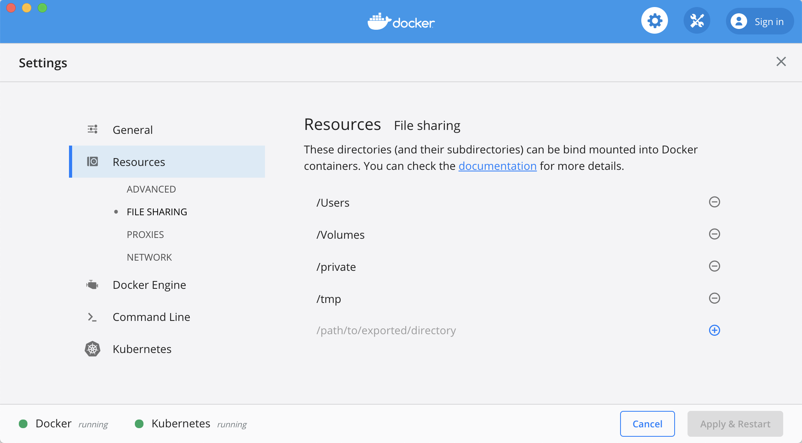
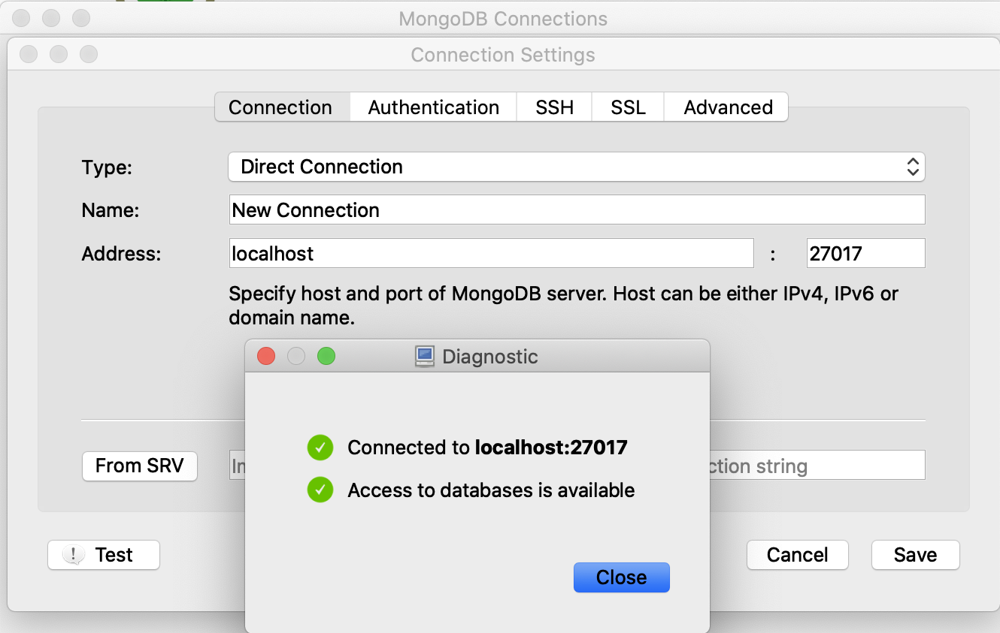
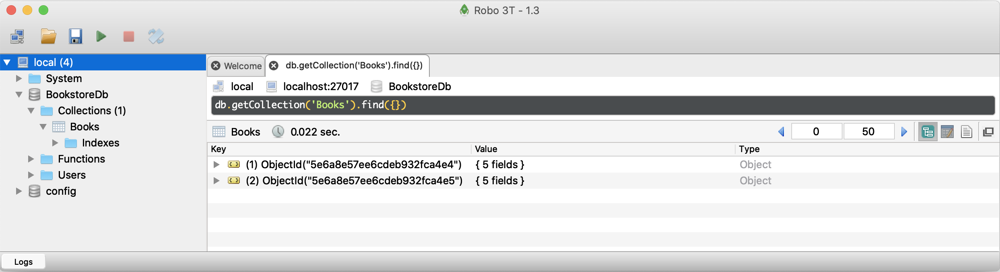

# Using MongoDb with .NET Core

## Prerequisites

- Install [Docker Desktop](https://www.docker.com/products/docker-desktop).
  - To run Docker in Windows on Parallels for Mac [enable nested virtualization](https://kb.parallels.com/en/116239).
  - To run Docker on Windows [enable Hyper-V](https://docs.microsoft.com/en-us/virtualization/hyper-v-on-windows/quick-start/enable-hyper-v#enable-the-hyper-v-role-through-settings)
- Install [Robo 3T](https://robomongo.org/download).
- Install [.NET Core SDK](https://dotnet.microsoft.com/download) 3.1 or greater.
- Install [dotnet aspnet-codegenerator](https://docs.microsoft.com/en-us/aspnet/core/fundamentals/tools/dotnet-aspnet-codegenerator?view=aspnetcore-3.1).

## MongoDb via Docker

- Check that the `tmp` folder is shared with Docker.
  - From Docker, select Preferences, File Sharing.
    
- Run MongoDb Version 3.x via Docker.
  - This command will mount a volume where a shared database will reside on the host system in /tmp.
    ```
    docker run --name mongo -d --rm -p 27017:27017 -v /tmp/mongo/data:/data/db mongo:3-xenial
    ```
  - Check to see if it is running.
    ```
    docker ps
    ```
- Connect to the mongo shell.
    ```
    docker exec -it mongo bash
    mongo
    ```
- Create the database, add a collection, insert data.
    ```
    use BookstoreDb
    db.createCollection('Books')
    db.Books.insertMany([{'Name':'Design Patterns','Price':54.93,'Category':'Computers','Author':'Ralph Johnson'}, {'Name':'Clean Code','Price':43.15,'Category':'Computers','Author':'Robert C. Martin'}])
    ```
- View the documents in the database.
    ```
    db.Books.find({}).pretty()
    ```
- Connect to MongoDb from Robo 3T.
    
  - Refresh the local connection to view the BookstoreDb database.
    

## Web API

- Create a new ASP.NET Core Web API project.
  ```
  dotnet new webapi -n HelloMongoDb
  cd HelloMongoDb
  ```
- Add required packages.
  ```
  dotnet add package Microsoft.VisualStudio.Web.CodeGeneration.Design
  dotnet add package MongoDB.Driver
  ```
- Add `BookstoreDatabaseSettings` section to appsettings.json.
    ```json
    "BookstoreDatabaseSettings": {
    "BooksCollectionName": "Books",
    "ConnectionString": "mongodb://localhost:27017",
    "DatabaseName": "BookstoreDb"
    }
    ```
- Create a `Models` directory, add BookstoreDatabaseSettings.cs file.
    ```csharp
    public class BookstoreDatabaseSettings : IBookstoreDatabaseSettings
    {
        public string BooksCollectionName { get; set; }
        public string ConnectionString { get; set; }
        public string DatabaseName { get; set; }
    }

    public interface IBookstoreDatabaseSettings
    {
        string BooksCollectionName { get; set; }
        string ConnectionString { get; set; }
        string DatabaseName { get; set; }
    }
    ```
- Update `ConfigureServices` in `Startup` to register `IBookstoreDatabaseSettings` and `IMongoDatabase`.
    ```csharp
    public void ConfigureServices(IServiceCollection services)
    {
        services.Configure<BookstoreDatabaseSettings>(
            Configuration.GetSection(nameof(BookstoreDatabaseSettings)));
        services.AddSingleton<IBookstoreDatabaseSettings>(sp =>
            sp.GetRequiredService<IOptions<BookstoreDatabaseSettings>>().Value);
        services.AddSingleton<IMongoDatabase>(sp =>
        {
            var settings = sp.GetRequiredService<IBookstoreDatabaseSettings>();
            var client = new MongoClient(settings.ConnectionString);
            return client.GetDatabase(settings.DatabaseName);
        });
        services.AddControllers();
    }
    ```

## Model Controller

- Add a `Book` model to the Models folder.
    ```csharp
    public class Book
    {
        [BsonId]
        [BsonRepresentation(BsonType.ObjectId)]
        public string Id { get; set; }

        [BsonElement("Name")]
        public string BookName { get; set; }

        public decimal Price { get; set; }

        public string Category { get; set; }

        public string Author { get; set; }
    }
    ```
- Scaffold Web API Controller.
    ```
    dotnet aspnet-codegenerator controller -name BookController -actions -api -outDir Controllers
    ```
- Inject `IMongoDatabase` and `IBookstoreDatabaseSettings` into controller constructor. Initialize `IMongoCollection<Book>`.
    ```csharp
    public IMongoDatabase Context { get; }
    public IMongoCollection<Book> Collection { get; }
    public IBookstoreDatabaseSettings Settings { get; }

    public BookController(IMongoDatabase context, IBookstoreDatabaseSettings settings)
    {
        Context = context;
        Settings = settings;
        Collection = Context.GetCollection<Book>(Settings.BooksCollectionName);
    }
    ```
- Write methods for Get, Post, Put and Delete.
    ```csharp
    // GET: api/Book
    [HttpGet]
    public async Task<ActionResult<IEnumerable<Book>>> Get()
    {
        var result = await Collection
            .Find(e => true).ToListAsync();
        return Ok(result);
    }

    // GET: api/Book/5
    [HttpGet("{id}", Name = nameof(Get))]
    public async Task<ActionResult<Book>> Get(string id)
    {
        var result = await Collection
            .Find(e => e.Id == id).SingleOrDefaultAsync();
        return Ok(result);
    }

    // POST: api/Book
    [HttpPost]
    public async Task<IActionResult> Post([FromBody] Book value)
    {
        await Collection
            .InsertOneAsync(value);
        return CreatedAtAction(nameof(Get), new { id = value.Id }, null);
    }

    // PUT: api/Book/5
    [HttpPut("{id}")]
    public async Task<ActionResult<Book>> Put(string id, [FromBody] Book value)
    {
        if (string.Compare(id, value.Id, true) != 0) return BadRequest();
        var result = await Collection
            .FindOneAndReplaceAsync(e => e.Id == id, value);
        return Ok(result);
    }

    // DELETE: api/ApiWithActions/5
    [HttpDelete("{id}")]
    public async Task<IActionResult> Delete(string id)
    {
        var result = await Collection.DeleteOneAsync(e => e.Id == id);
        if (result.DeletedCount == 0) return NotFound();
        return NoContent();
    }
    ```
- To test the controller, run the following from Postman.
```json
GET: https://localhost:5001/api/book/
GET: https://localhost:5001/api/book/5e6a8e57ee6cdeb932fca4e4
POST: https://localhost:5001/api/book/
{
    "bookName": "CLR via C#",
    "price": 49.99,
    "category": "Computers",
    "author": "Jeffrey Richter"
}
PUT: https://localhost:5001/api/book/5e6ac67b2caf3638584b0cb3
{
    "id": "5e6ac67b2caf3638584b0cb3", // Use generated id
    "bookName": "CLR via C#",
    "price": 59.99,
    "category": "Computers",
    "author": "Jeffrey Richter"
}
DELETE: https://localhost:5001/api/book/tonys
```
